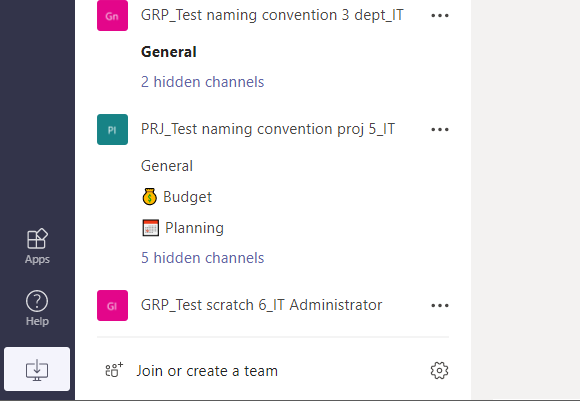

# Naming Conventions

Provision Assist includes the ability to define Naming Conventions/Policies for created Sites/Groups/Teams/Viva Engage communities.

When a user makes a request through the Power App, the naming convention will be applied and a preview of how this will look when combined with the title they have entered will be shown (See 'Space display name' below). 

Naming conventions can be configured at the following levels:

1. Global - All requests will adhere to this naming convention if no additional convention is configured as per the below.
2. Space - Define specific naming conventions for to each space type e.g. Team Site, Communication Site, Office 365 Group etc. Space types are the types of collaboration space a user can create and these reside in the 'Provisioning Types' list. When a user selects a type with a naming convention configured, this will be used.
3. Teams Template - Define naming conventions specific to an individual Teams template. These can be set in the 'Teams Templates' list. A naming convention applied to a Teams template would override one configured for a Teams Team in the 'Provisioning Types' list.

Global & Space Type - Requests created where **no** naming convention is assigned to the selected space type will use the 'Global' convention and where defined, space types will use their own naming convention.

Teams Template - Overrides Global and Space Type if the user selects a teams template that has a naming convention configured.

There is no UI in the Power App to configure this yet (we are working on this) so naming conventions must be set up in the SharePoint site for now.

_Note - If no space types/teams templates have naming conventions configured and naming conventions have been enabled, the templates will use the Global configuration._

## What does this look like?

**Teams:**

When a team is created using a naming convention, it will appear as follows:

- In the example above 'GRP_' and 'PRJ_' are the configured prefixes.

- The middle part is the Space Title that the user specifies when making a request. In this case the user has selected to create a teams team.

- All three examples above are using attributes for the suffix. The first two are the users' department and the last team in the list shows the users' Job Title.

- All three examples are using text (in addition to attributes) to separate the space/team title with underscores. This is configurable so dashes etc. could be used. **Any spaces in the Prefix or Suffix should be automatically removed.**

**SharePoint Sites (Team Sites/Office 365 Groups/Comms Sites/Hub Sites and those backing a team):**

The Name and URL will follow that of the naming convention:

The SharePoint site URL will have any spaces in the 'Space Title' removed.

**Viva Engage:**

Viva Engage communities act the same as a teams team. The display name will contain spaces if specified in the space title and the alias for the group will have the spaces removed. 

e.g. VE_My Viva Engage Community_IT (Where IT is the users' department).

**Azure AD:**

The group name and email address in Azure AD will match the specified naming convention. The group name will retain spaces but the email will have these automatically removed.

## Configuration

To enable this functionality, the value of the **'UseNamingConventions** setting in the 'Provisioning Request Settings' list MUST be set to 'true'. By default this will be set to 'false' after deployment.

***Global naming convention***

Before creating any naming conventions at the space type/Teams template level, it is important to set a global naming convention. 

_Both a Prefix and/or Suffix can be set which will be prepended and appended to the Space Title entered by the user when requesting a space._

---

To set a **global naming convention**, follow the steps below:

1. Navigate to the 'Provisioning Request Settings' list in the SharePoint site.
2. Edit the 'NamingConvention' list item and specify the following values (these are examples and can be replaced with your own):

**Value** - Leave blank
**PrefixAttribute** - Leave blank OR select an attribute (from the users' profile) to use. In this example leave blank.
**PrefixText** - Set to 'GRP_' (or any text you wish to use for the prefix). 
**PrefixUseAttribute** - Set to 'Yes' IF you selected an attribute OR set to False if you did not define an attribute. For this example set it to 'No'.
**SuffixAttribute** - Leave blank OR select an attribute (from the users' profile) to use. In this example set it to 'Department' (The users' department). 
**SuffixText** - Set to '_' for this example (or any text you wish to use for the suffix). 
**SuffixUseAttribute** - Set to 'Yes' IF you selected an attribute OR set to False if you did not define an attribute. For this example set it to 'Yes'.

For all other fields please DO NOT edit the values.

_Note - If you use PrefixText AND a PrefixAttribute. The text will be appended onto the end of the attribute value. This is so that you can separate the attributes/text from the Space Title e.g. 'HR_'._ The same happens with SuffixText and SuffixAttribute.

3. Save the list item.

A global naming convention has now been configured. When a space is requested, it should look something like:

GRP_Space Title_UsersDepartment e.g. GRP_My New Site_HR

Please now test the naming convention by creating a new request.

Please make sure that users making requests have configured values for the attribute you selected above otherwise the attribute you selected above will not have a value. So the user would need a value for JobTitle, Department, Company, Office, StateOrProvince, CountryOrRegion. 

---

***Space type convention***

Space type conventions allow you to set specific naming conventions for each type of space a user can request i.e. Team Site, Office 365 Group, Microsoft Teams Team, Communication Site, Hub Site and a Viva Engage Community. These are the ones that are displayed on the 'Recommendation' screen in the Power App. If space types have naming conventions defined these will **override** the global one. 

For this example, we will apply a specific naming convention to Communication Sites.

This functionality works in a similar way to the global naming convention so should be easy to follow:

To set a **Space type naming convention**, follow the steps below:

1. Navigate to the 'Provisioning Types' list in the SharePoint site.
2. Edit one of the list items, in this case we will choose 'Communication Site'.
3. Configure the values as follows - 

**Prefix Text** - Set to 'COMM_' (or any text you wish to use for the prefix). 
**Prefix Use Attribute** - Set to 'Yes' IF you selected an attribute OR set to False if you did not define an attribute. For this example set it to 'No'.
**Prefix Attribute** - Leave blank OR select an attribute (from the users' profile) to use. In this example leave blank.

**SuffixText** - Set to '_' for this example (or any text you wish to use for the suffix). 
**Suffix Attribute** - Leave blank OR select an attribute (from the users' profile) to use. In this example set it to 'Department' (The users' department). 
**Suffix Use Attribute** - Set to 'Yes' IF you selected an attribute OR set to False if you did not define an attribute. For this example set it to 'Yes'.

4. Save the list item.

An space type naming convention has now been configured for a Communication Site. When a Communication Site is chosen when a user creates a request, it should look something like:

COMM_Space Title_UsersDepartment e.g. COMM_My New Communication Site_HR

Please now test the naming convention by creating a new request selecting 'Communication Site' on the Recommendation screen.

---

***Teams template naming convention***

Teams template naming conventions allow you to set specific naming conventions for teams templates (or types of teams). If templates have naming conventions defined these will **override** the global one AND those set at the space type level.

For more details on how to create templates for use with Provision Assist, please follow this documentation on GitHub - https://github.com/OfficeDev/microsoft-teams-apps-requestateam/wiki/Teams-Templates. 

For this example, we will apply a naming convention to one of the Microsoft out of the box templates but you can define your own templates as per the documentation above and configure naming conventions against these.

This functionality works in a similar way to the global naming convention so should be easy to follow:

To set a **Teams template naming convention**, follow the steps below:

1. Navigate to the 'Teams Templates' list in the SharePoint site.
2. Edit one of the list items, in this case we will choose 'Manage a Project'.
3. Configure the values as follows - 

**Prefix Text** - Set to 'DEPT_' (or any text you wish to use for the prefix). 
**Prefix Use Attribute** - Set to 'Yes' IF you selected an attribute OR set to False if you did not define an attribute. For this example set it to 'No'.
**Prefix Attribute** - Leave blank OR select an attribute (from the users' profile) to use. In this example leave blank.

**SuffixText** - Set to '_' for this example (or any text you wish to use for the suffix). 
**Suffix Attribute** - Leave blank OR select an attribute (from the users' profile) to use. In this example set it to 'Department' (The users' department). 
**Suffix Use Attribute** - Set to 'Yes' IF you selected an attribute OR set to False if you did not define an attribute. For this example set it to 'Yes'.

4. Save the list item.

A template naming convention has now been configured for the selected template. When a space is requested and the user selects the 'Departmental' teams template, it should look something like:

DEPT_Team Name_UsersDepartment e.g. DEPT_My Project Team_HR

Please now test the naming convention by creating a new request selecting 'Use template' and choose the 'Departmental' template. 

_Note - If you wish to define a template that has no content. Update the value of 'Template Id' to 'standard'._