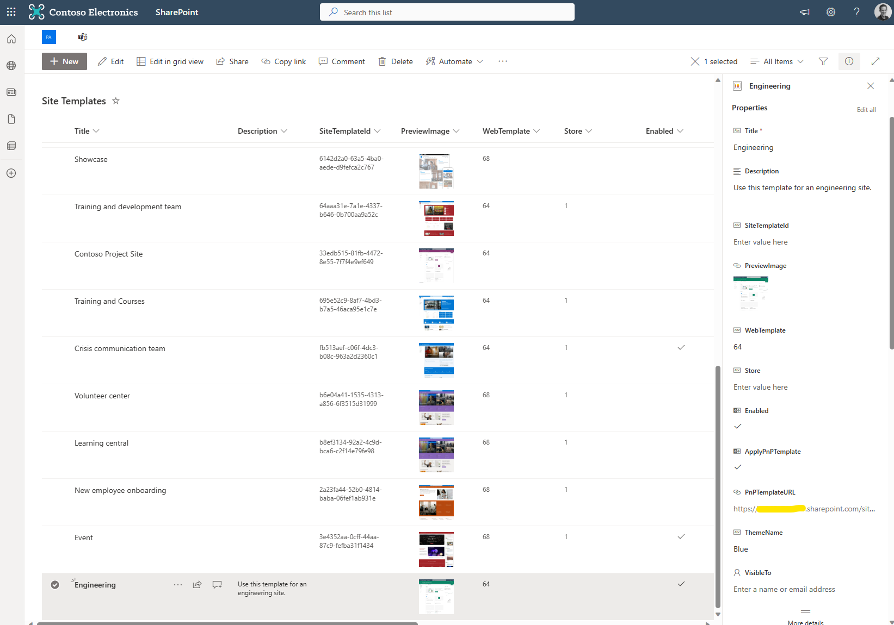

# PnP Templates

Provision Assist includes the ability to apply PnP Provisioning templates when a user requests the creation of a SharePoint Site (Team Site, Office 365 Group, Communication Site or Hub Site).

Currently these can be applied **instead** of Site Templates and **cannot** be applied to Microsoft Teams 'Teams'.

PnP Template files can be stored in the **'PnP Templates'** document library. These need to be in **.pnp file format** for them to work. 

See this documentation - https://pnp.github.io/powershell/cmdlets/Save-PnPProvisioningTemplate.html for how to convert a PnP XML file to the .pnp format.

Once you have uploaded your PnP template files, you need to add a reference to the template in the **'Site Templates'** list. This associates the PnP template with the Site Template.

To create a reference to a PnP template, create an item in the Site Templates list, populating the following columns:

- Title (Title of the template e.g. Engineering)
- Description - Description of the template
- Enabled - Whether or not the site template should be displayed in the Power App for users to select.
- PnP Template - Yes
- PnPTemplateURL - Paste the URL to your PnP template file from the **'PnP Templates'** document library. **IMPORTANT: Ensure that this is the full path to the file and not a shortcut URL**. 
- ThemeName - Name of a SharePoint theme in your tenant to apply after the site is created. Themes cannot be set in PnP templates so this offers the ability to apply a theme. Simply set this to a valid theme in your tenant, can be out of the box or a custom theme. 

See the below screenshot which shows a PnP template in the Site Templates list. Please leave all other columns empty. 

When a user selects the template in the Power App, the linked PnP template will be applied to the site using the 'ProcessProvisionRequest' logic app and PnP PowerShell through the ConfigureSpace Azure Automation runbook. 

_In a future update we will look at adding PnP template support for MS Teams 'Teams' and also the ability to apply both a Site Template AND a PnP template._